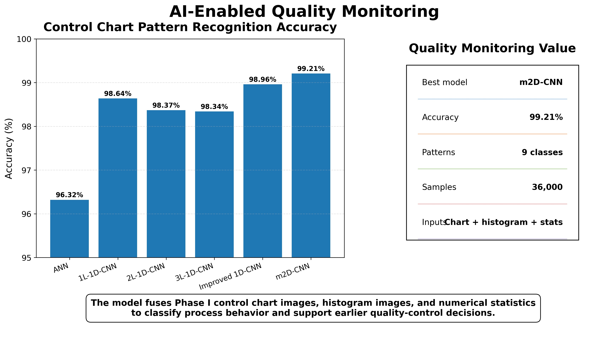
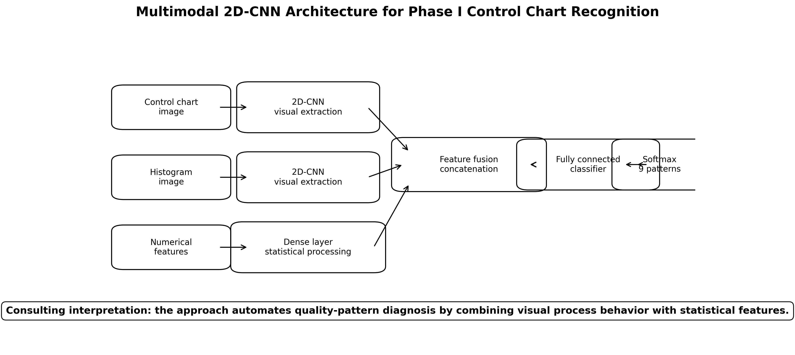
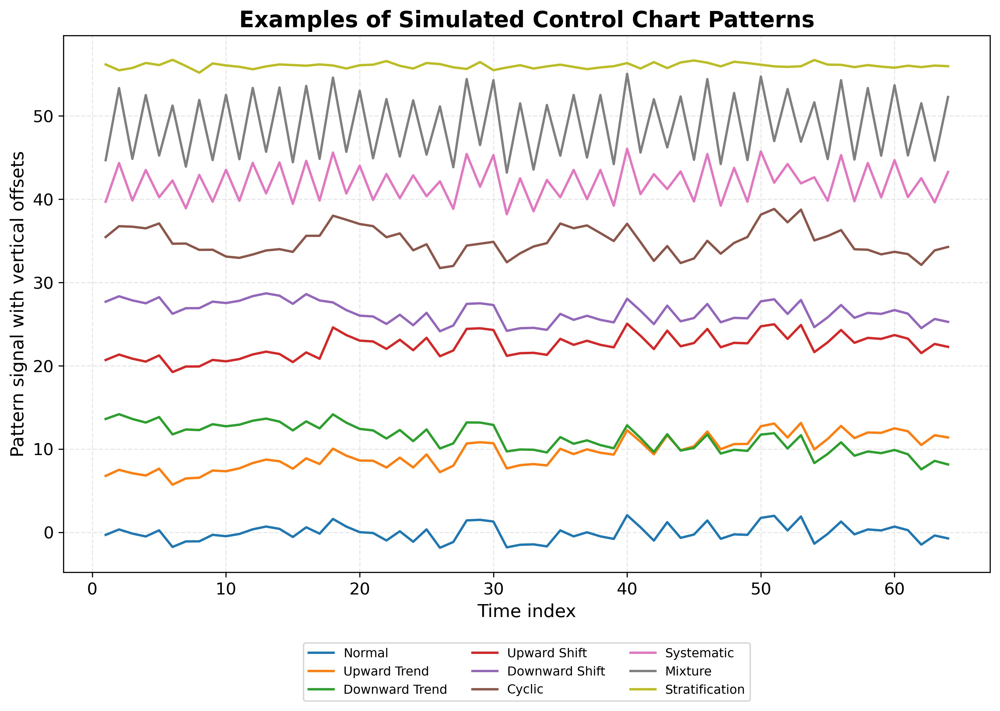
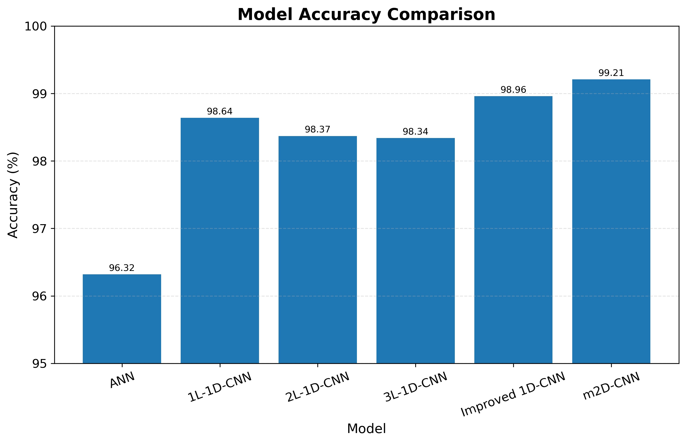

# AI-Enabled Quality Monitoring: Phase I Control Chart Pattern Recognition Using Multimodal 2D-CNN

## Project overview

This repository presents an AI-enabled quality monitoring case study based on the published paper:

**Ramadan, S., & Almasarwah, N. (2025). Pattern Recognition in Phase I Control Charts via Multimodal 2D Convolutional Neural Networks: A Fusion of Visual and Numerical Data. 2025 IEEE International Conference on Emerging Trends in Engineering and Computing (ETECOM).**

The project demonstrates how a **multimodal 2D Convolutional Neural Network (m2D-CNN)** can classify Phase I control chart patterns by fusing:

- Phase I control chart images
- Histogram images
- Numerical features: mean, standard deviation, and skewness



## Business problem

Manufacturing and service processes require effective quality monitoring to detect instability early. Traditional Statistical Process Control (SPC) relies on control charts, but identifying abnormal patterns can be manual, inconsistent, and difficult when patterns are complex.

The business question addressed in this project is:

> Can multimodal deep learning improve Phase I control chart pattern recognition by combining visual process behavior with numerical statistical features?

## Proposed solution

The proposed m2D-CNN model uses two main processing paths:

1. **Visual feature extraction path**
   - Processes Phase I control chart images.
   - Processes histogram images.
   - Uses 2D-CNN layers to extract visual features.

2. **Numerical feature processing path**
   - Processes mean, standard deviation, and skewness.
   - Uses dense layers to capture statistical information.

The outputs are fused into a unified feature vector and classified using a fully connected neural network with Softmax activation.



## Control chart patterns

The model classifies nine Phase I control chart patterns:

| Code | Pattern |
|---|---|
| NOR | Normal / Random |
| UT | Upward Trend |
| DT | Downward Trend |
| US | Upward Shift |
| DS | Downward Shift |
| CYC | Cyclic |
| SYS | Systematic |
| MIX | Mixture |
| STR | Stratification |



## Experimental setup

The paper reports the following setup:

| Item | Value |
|---|---:|
| Control chart patterns | 9 |
| Samples per pattern | 4,000 |
| Total samples | 36,000 |
| Sequence length | 64 |
| Training / validation split | 80% / 20% |
| Repeated experiments | 30 |

## Model performance

The proposed m2D-CNN achieved the highest reported accuracy among the evaluated models:

| Model | Accuracy (%) | Standard deviation |
|---|---:|---:|
| ANN | 96.32 | 1.90 |
| 1L-1D-CNN | 98.64 | 0.56 |
| 2L-1D-CNN | 98.37 | 0.52 |
| 3L-1D-CNN | 98.34 | 0.63 |
| Improved 1D-CNN | 98.96 | 0.32 |
| Proposed m2D-CNN | 99.21 | 0.39 |



## Consulting value

This project is relevant to:

- Quality engineering
- Statistical Process Control
- Manufacturing analytics
- Process monitoring
- AI-enabled quality inspection
- Early abnormality detection
- Defect prevention and process improvement

## Repository contents

```text
ai_enabled_quality_monitoring/
│
├── README.md
├── CITATION.cff
├── requirements.txt
│
├── docs/
│   ├── executive_summary.md
│   ├── methodology.md
│   ├── business_impact.md
│   └── limitations_and_future_work.md
│
├── figures/
│   ├── project15_quality_monitoring_summary.jpg
│   ├── 01_multimodal_cnn_architecture.jpg
│   ├── 02_model_accuracy_comparison.jpg
│   ├── 03_model_stability_comparison.jpg
│   ├── 04_simulated_control_chart_patterns.jpg
│   ├── 05_data_generation_evaluation_pipeline.jpg
│   └── 06_accuracy_vs_stability_tradeoff.jpg
│
├── data/
│   ├── model_comparison.csv
│   ├── control_chart_patterns.csv
│   ├── experiment_summary.csv
│   ├── m2d_cnn_hyperparameters.csv
│   ├── confusion_summary_notes.csv
│   └── sample_control_chart_patterns.csv
│
└── notebooks/
    └── quality_monitoring_m2d_cnn_demo.ipynb
```

## Disclaimer

This repository is prepared for educational, research, and portfolio demonstration purposes. The included data files are summary/demo files based on values reported in the paper and simulated examples.
